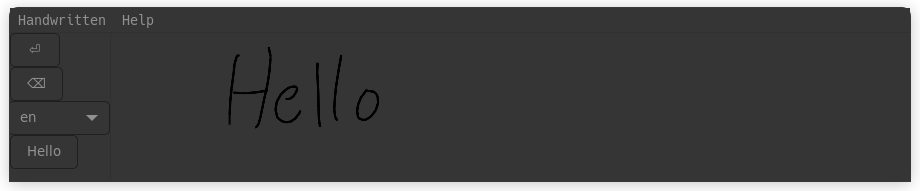

# handwritten

A tool for handwritten input

> **NOTE**: this app is very much in an alpha state

Features include:

- emulate keyboard [input](#keyboard-input)
- local [OCR](#ocr)
- multi-platform [support](#support)
- many languages

## support

The [BeeWare](https://beeware.org/) suite of tools enables this app to support several platforms.
However, the availability of various features at any given state can vary.

| purpose  | tool    | linux | macos | windows | web | android | ios |
| -------- | ------- | ----- | ----- | ------- | --- | ------- | --- |
| kb input | pynput  | x     |       |         | -   | -       | -   |
| ocr      | easyocr | x     |       |         |     |         |     |

- `x`: tested
- ` `: untested (empty)
- `-`: unsupported

### keyboard input

`pynput` was the first lib I found when searching but it seems to work decently well.
It doesn't support web or mobile (so far as I know) so it may need to be augmented or replaced.

### ocr

`easyocr` is easy but doesn't provide handwriting recognition.
Perhaps tweaking the values could help but it's likely to need to be replaced.

## configure

Random bits of potential usefulness that may or may not make it into the app at a later date.

### keep on top of stack

When interacting with other applications, it can be helpful to not loose the main window.
One solution here is to mark this app to always be drawn over other windows.

- Linux: right click window header and select "Always on Top"

## contributing

Create a dev env:

    nix develop

Then start the app:

    briefcase dev
